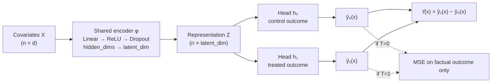

# Causal Representation Learning for Heterogeneous Treatment Effect Estimation

Do learned representations improve heterogeneous treatment-effect estimation
compared with conventional causal ML meta-learners — and under what conditions
do they stop helping?

This repository is an experimental study, not a demo. It compares four CATE
estimators across six controlled experiments on two benchmarks, reports every
result with dispersion and paired significance tests, and states plainly where
the neural model wins, ties, and loses.

> **Every number in the Results section is generated by
> `scripts/build_results_section.py` directly from the CSVs in `results/raw/`.**
> No metric in this README was typed by hand. Experiments that have not been run
> are rendered as explicit `PENDING` lines rather than estimated or omitted.

---

## 1. Research question

> Can learned representations improve heterogeneous treatment-effect estimation
> compared with conventional causal ML learners under varying levels of
> confounding and treatment imbalance?

The question is comparative and conditional. A single average score cannot
answer it, so the design varies confounding, imbalance and sample size as
explicit experimental factors and measures how each estimator responds.

## 2. Motivation

Meta-learners (S/T/X) reduce causal estimation to a set of standard regression
problems. That is a strength — any regressor can be plugged in — but it means
each arm's outcome model is fitted in isolation. When one treatment arm is
small, its model is estimated from few units and nothing in the procedure lets
the larger arm inform it.

A shared representation is the obvious structural answer: if both potential
outcome surfaces depend on the same underlying features of `X`, learning those
features jointly should let the data-rich arm regularise the data-poor one.
That is the mechanism this project tests. It is a hypothesis about *when*
representation sharing pays off, not an assumption that it always does.

## 3. Causal formulation

Using the Neyman–Rubin potential outcomes framework, each unit `i` has
covariates `X_i`, a binary treatment `T_i ∈ {0,1}` and two potential outcomes
`Y_i(0)`, `Y_i(1)`. Only the one matching the assigned treatment is observed:

```
Y_i = T_i · Y_i(1) + (1 − T_i) · Y_i(0)
```

This is the fundamental problem of causal inference — the other outcome is
never observed for any unit, which is why treatment effects cannot be evaluated
on real data and why semi-synthetic benchmarks exist.

**Estimands.**

```
CATE:  τ(x) = E[ Y(1) − Y(0) | X = x ]
ATE:   τ    = E[ τ(X) ]
```

**Identifying assumptions.** These are what make `τ(x)` recoverable from
observational data, and each is a place the estimates can fail:

| Assumption | Statement | Role here |
|---|---|---|
| SUTVA | No interference between units; one version of treatment | Assumed throughout; both benchmarks generate units independently, so it holds by construction |
| Unconfoundedness | `(Y(0), Y(1)) ⟂ T \| X` | Holds in both benchmarks because every confounder is recorded. Experiment 2 varies *how strongly* the recorded confounders drive treatment |
| Positivity / overlap | `0 < P(T=1 \| X=x) < 1` for all `x` | Directly stressed by Experiments 2 and 3; measured per condition via propensity tails and the treated/control propensity KS statistic |

**Confounding and selection bias.** When covariates drive both treatment and
outcome, treated and control groups differ systematically, so the naive
difference in observed means estimates `E[Y|T=1] − E[Y|T=0]`, not `τ`. The
propensity score `e(x) = P(T=1 | X=x)` summarises that assignment mechanism;
as it approaches 0 or 1 for some units, those units have effectively no
counterparts in the other arm and their effects must be extrapolated rather
than estimated.

**Distribution shift.** Because treated and control covariate distributions
differ under confounding, a model fitted on one arm is applied to units drawn
from a different distribution when predicting the counterfactual. This is the
covariate-shift problem that *motivates* representation learning here.

> **Scope caveat.** Covariate shift between arms is a *consequence* of
> confounding in these experiments, never an independently manipulated factor.
> No experiment in this project isolates covariate shift, so no result below
> should be read as demonstrating robustness to distribution shift as such.
> Experiment 2 manipulates confounding strength; what it can speak to is
> treatment-selection bias, overlap/positivity degradation, and their effect on
> individual-level effect estimation.

## 4. Datasets

Two benchmarks are used deliberately, and the reason is methodological rather
than cosmetic.

### IHDP (semi-synthetic) — external validity

The Infant Health and Development Program benchmark in its standard NPCI form:
747 units, 25 covariates, 100 independent outcome realizations, with noiseless
response surfaces `mu0` and `mu1` so PEHE is exactly computable. Covariates and
treatment come from a real randomized experiment; Hill (2011) then removed all
treated children of non-white mothers, which breaks randomization and
manufactures confounding.

Verified directly against the raw files rather than assumed: the pooled
train+test covariate matrix is *identical* across all 100 realizations and the
pooled treated fraction is exactly **0.1861** throughout. What varies per
realization is (a) which 672 of 747 units land in train vs test, and (b) the
simulated response surfaces. Realizations are therefore genuine replicates.

**IHDP cannot answer Experiments 2 and 3.** Its confounding level and treatment
mechanism are fixed properties of the published files. Treating them as
experimental factors would require inventing a knob that does not exist.

### Synthetic (fully controlled) — internal validity

A generator in which confounding strength and treated fraction are independent,
documented parameters:

```
X ~ N(0, I_d)                                        d = 20, k = 5 confounders
e(x)   = sigmoid( a0 + γ · (x[:, :k] @ w) )
T      ~ Bernoulli( e(x) )
mu0(x) = x @ β + 0.5·sin(π·x_0)
τ(x)   = 1 + 0.5·x_0 + 0.25·(x_1² − 1)
mu1(x) = mu0(x) + τ(x)
Y      = mu_T(x) + N(0, σ²)
```

`β` is non-zero on the first `k` covariates, so those covariates drive both
treatment and outcome — they are genuine confounders.

- **γ (`confounding_strength`)** scales how strongly confounders drive
  treatment. `γ = 0` is a randomized trial with perfect overlap; larger `γ`
  pushes propensities toward 0/1, creating selection bias and eroding positivity.
- **`a0`** is solved numerically by bisection to hit a target marginal
  `P(T=1)`, so imbalance can be varied while holding `γ` fixed.

Two design properties are enforced by unit tests, because without them the
experiments would be uninterpretable:

1. The intercept solver hits every target treated fraction at every `γ`, so the
   two factors are genuinely independent.
2. **The true ATE stays at 1.0 across all conditions.** Error changes therefore
   reflect estimation difficulty, not a moving estimand.

## 5. Methods

| Model | Strategy | Expected failure mode |
|---|---|---|
| **S-Learner** | One regressor on `[X, T]`; `τ̂ = f([x,1]) − f([x,0])` | A flexible learner can shrink the treatment feature toward zero, biasing effects to 0 |
| **T-Learner** | Separate regressor per arm; `τ̂ = f₁(x) − f₀(x)` | The smaller arm is fitted on few units; no sharing between arms |
| **X-Learner** | Per-arm models → cross-imputed effects → propensity-weighted blend | More robust when arms are unbalanced; more moving parts to misfit |
| **NeuralRep** | Shared encoder + treatment-specific heads (TARNet-style) | Needs enough data to learn a representation; can overfit small samples |

All meta-learners wrap the same gradient-boosting base regressor, so
differences between them reflect the *meta-learning strategy* rather than the
base model class.

## 6. Model architecture



Only the head matching a unit's **observed** treatment contributes to the loss;
the counterfactual head is exercised only at prediction time. No counterfactual
information enters training. The shared encoder is the sole channel through
which control units inform the treated head and vice versa — which is precisely
the mechanism Experiment 5 ablates.

Configurable: `hidden_dims`, `latent_dim`, `head_hidden_dims`, `dropout`,
`lr`, `batch_size`, `epochs`, `weight_decay`, `val_fraction`, `early_stopping`,
`patience`, `seed`.

## 7. Experimental design

| # | Experiment | Benchmark | Factor varied | Config |
|---|---|---|---|---|
| 1a | Baseline comparison | IHDP | — (30 seeds) | `configs/baseline.yaml` |
| 1b | Baseline comparison | Synthetic | — (30 seeds) | `configs/baseline_synthetic.yaml` |
| 2 | Confounding | Synthetic | γ ∈ {0, 1, 2, 3} | `configs/confounding.yaml` |
| 3 | Treatment imbalance | Synthetic | P(T=1) ∈ {0.5, 0.25, 0.1} | `configs/treatment_imbalance.yaml` |
| 4a | Sample size | IHDP | 25/50/75/100% of train | `configs/sample_size.yaml` |
| 4b | Sample size | Synthetic | 25/50/75/100% of 8000 | `configs/sample_size_synthetic.yaml` |
| 5a | Component ablation | IHDP | 4 variants | `configs/ablation.yaml` |
| 5b | Component ablation | Synthetic | 4 variants | `configs/ablation_synthetic.yaml` |
| 6 | Hyper-parameter sensitivity | IHDP | latent dim, weight decay, lr, epochs | `configs/sensitivity.yaml` |
| 7 | **Fair model selection** | IHDP + synthetic | equal tuning budget for all 4 estimators, 5 scenarios | `configs/fair_selection.yaml` |

**Controls applied uniformly.** Covariates are standardized on training
statistics only; the outcome is standardized and predicted effects are rescaled
back to the original scale before evaluation, so all models are scored
identically. In sample-size experiments the **test set is held fixed** across
conditions, so differences reflect training size rather than a changing
evaluation set.

**Ablation variants** (Experiment 5) each change exactly one component:

| Variant | Change | Isolates |
|---|---|---|
| `full` | — | Reference |
| `no_representation` | Encoder → identity; heads read raw `X` | The learned representation |
| `no_treatment_heads` | One head on `[φ(x), t]` | Treatment-specific heads |
| `no_regularization` | `dropout = 0`, `weight_decay = 0` | Regularization |

The `epochs` sweep in Experiment 6 disables early stopping automatically,
otherwise the epoch budget would not actually vary.

**Experiment 7 — fair model selection.** Experiments 1–6 gave the neural model
adaptive capacity control (early stopping) while the meta-learners used fixed
defaults, so their cross-model comparisons contrast *configured estimators*
rather than modelling strategies. Experiment 7 equalises the budget:

| Element | Setting |
|---|---|
| Scenarios | 5 — IHDP baseline, synthetic γ=0, γ=2, γ=3, synthetic 10% treated |
| Seeds | 30 per scenario |
| Models | S-, T-, X-Learner, NeuralRep |
| Candidates per model | **6**, identical count for every estimator |
| Validation split | Same train/validation partition, from the same seed, for every model |
| Selection criterion | **Factual validation MSE** — error of the predicted outcome under the *observed* treatment |
| PEHE in selection | **Never used.** It requires counterfactuals no practitioner observes; selecting on it would be oracle selection and would leak the evaluation target |
| Neural early stopping | **Disabled.** The epoch budget (100/200/400) is a tuned hyper-parameter like any other |
| After selection | Selected configuration refit on the **full** training set |
| Evaluation | PEHE, absolute ATE error, policy regret on held-out test data |
| Statistics | Paired Wilcoxon signed-rank, Holm-Bonferroni within scenario |

The three meta-learners share one gradient-boosting grid so that differences
among them stay attributable to meta-learning strategy. Selected configurations
were re-instantiated and checked against the fitted estimators' actual
attributes; per-model tuning and refit wall-clock times are recorded on every
row, so the realised compute budget is reported rather than assumed equal
(the budget is equal in *trials*, not in wall-clock).

## 8. Evaluation metrics

This is an estimation problem, so classification accuracy is deliberately
absent. Primary metrics:

| Metric | Definition | Reads as |
|---|---|---|
| **PEHE** | `sqrt( mean_i (τ̂(x_i) − τ(x_i))² )` | Individual-level accuracy; the headline metric |
| **Absolute ATE error** | `\| mean(τ̂) − mean(τ) \|` | Population-level accuracy |
| **CATE MAE / bias** | `mean\|τ̂ − τ\|` / `mean(τ̂ − τ)` | Magnitude vs systematic direction of error |
| **Policy value** | `E[ π(x)·mu1 + (1−π(x))·mu0 ]`, `π = 1{τ̂ > 0}` | Value of acting on the estimates |
| **Policy regret** | Gap to the oracle `E[max(mu0, mu1)]` | Decision-quality loss; 0 is optimal |
| **Subgroup PEHE** | PEHE within quartiles of true `τ` | Whether errors concentrate in high-effect units |

Policy value is computed **exactly** from the known response surfaces, not
estimated by inverse propensity weighting.

**Design diagnostics** are recorded per condition, independent of any outcome
model: treated fraction, propensity range, mass in the tails `e<0.1` / `e>0.9`,
the treated-vs-control propensity KS statistic, and standardized mean
differences. These characterise how hard each condition is.

## 9. Statistical protocol

- Replicates are independent seeds — for IHDP, distinct outcome realizations.
- **All of Experiments 1–5 use 30 seeds**, fixed uniformly in advance rather
  than tuned per experiment. Experiment 6 uses 10 seeds because it sweeps 20
  hyper-parameter settings. An earlier 10-seed pass left several comparisons
  near the significance boundary; the seed count was raised for *every*
  experiment at once, not for the borderline ones, so no comparison was
  selected for extra power on the basis of its result.
- Reported as `mean ± SD (median)`. **The median matters here**: IHDP
  per-replicate errors are strongly right-skewed because a few realizations
  have very large outcome scales, so the mean is outlier-dominated.
- 95% confidence intervals are percentile bootstrap over replicates.
- Model comparisons use **paired** Wilcoxon signed-rank tests (all models see
  identical seeds and conditions), Holm-Bonferroni corrected within each
  condition.
- The word "significant" appears only where such a test was actually run.

---

## 10. Results

### Experiment 1a — baseline comparison (IHDP)

Replicates: 30 seeds. Cells are `mean ± SD (median)` across seeds; lower is better for PEHE, ATE error and policy regret.

**PEHE**

| condition | S-Learner | T-Learner | X-Learner | NeuralRep |
|---|---|---|---|---|
| default | 4.041 ± 8.018 (1.237) | 2.756 ± 4.586 (1.091) | 3.751 ± 6.751 (1.284) | 2.008 ± 3.231 (0.926) |

**Absolute ATE error**

| condition | S-Learner | T-Learner | X-Learner | NeuralRep |
|---|---|---|---|---|
| default | 0.694 ± 1.626 (0.151) | 0.323 ± 0.544 (0.121) | 0.379 ± 0.446 (0.213) | 0.228 ± 0.259 (0.169) |

**Policy regret**

| condition | S-Learner | T-Learner | X-Learner | NeuralRep |
|---|---|---|---|---|
| default | 0.173 ± 0.287 (0.065) | 0.085 ± 0.224 (0.017) | 0.196 ± 0.350 (0.073) | 0.050 ± 0.077 (0.019) |

**Paired Wilcoxon signed-rank tests on PEHE** (negative difference favours NeuralRep; Holm-corrected within each condition)

| condition | NeuralRep vs | mean PEHE diff | p (Wilcoxon) | reject H0 (Holm 0.05) |
|---|---|---|---|---|
| default | S-Learner | -2.032 | 0.0050 | yes |
| default | T-Learner | -0.748 | 0.0000 | yes |
| default | X-Learner | -1.742 | 0.0000 | yes |

**Manipulation check / design diagnostics** (mean over seeds). `true ATE` should stay constant across conditions — if it moves, error differences would be confounded with a shifting estimand.

| condition | true ATE | treated frac | max SMD | P(e<0.1) | P(e>0.9) | PS KS |
|---|---|---|---|---|---|---|
| default | 4.235 | 0.186 | 0.395 | 0.309 | 0.000 | 0.392 |


### Experiment 1b — baseline comparison (synthetic)

Replicates: 30 seeds. Cells are `mean ± SD (median)` across seeds; lower is better for PEHE, ATE error and policy regret.

**PEHE**

| condition | S-Learner | T-Learner | X-Learner | NeuralRep |
|---|---|---|---|---|
| default | 0.553 ± 0.057 (0.561) | 0.911 ± 0.043 (0.907) | 0.502 ± 0.029 (0.494) | 0.494 ± 0.033 (0.492) |

**Absolute ATE error**

| condition | S-Learner | T-Learner | X-Learner | NeuralRep |
|---|---|---|---|---|
| default | 0.362 ± 0.061 (0.364) | 0.120 ± 0.066 (0.109) | 0.059 ± 0.042 (0.049) | 0.096 ± 0.056 (0.092) |

**Policy regret**

| condition | S-Learner | T-Learner | X-Learner | NeuralRep |
|---|---|---|---|---|
| default | 0.007 ± 0.003 (0.006) | 0.121 ± 0.021 (0.119) | 0.027 ± 0.006 (0.028) | 0.014 ± 0.006 (0.013) |

**Paired Wilcoxon signed-rank tests on PEHE** (negative difference favours NeuralRep; Holm-corrected within each condition)

| condition | NeuralRep vs | mean PEHE diff | p (Wilcoxon) | reject H0 (Holm 0.05) |
|---|---|---|---|---|
| default | S-Learner | -0.059 | 0.0000 | yes |
| default | T-Learner | -0.417 | 0.0000 | yes |
| default | X-Learner | -0.008 | 0.1642 | no |

**Manipulation check / design diagnostics** (mean over seeds). `true ATE` should stay constant across conditions — if it moves, error differences would be confounded with a shifting estimand.

| condition | true ATE | treated frac | max SMD | P(e<0.1) | P(e>0.9) | PS KS |
|---|---|---|---|---|---|---|
| default | 0.996 | 0.498 | 0.601 | 0.019 | 0.017 | 0.373 |


### Experiment 2 — confounding strength (synthetic)

Replicates: 30 seeds. Cells are `mean ± SD (median)` across seeds; lower is better for PEHE, ATE error and policy regret.

**PEHE**

| confounding γ | S-Learner | T-Learner | X-Learner | NeuralRep |
|---|---|---|---|---|
| 0.0 | 0.434 ± 0.045 (0.428) | 0.887 ± 0.041 (0.887) | 0.431 ± 0.028 (0.426) | 0.474 ± 0.026 (0.476) |
| 1.0 | 0.553 ± 0.057 (0.561) | 0.911 ± 0.043 (0.907) | 0.502 ± 0.029 (0.494) | 0.494 ± 0.033 (0.492) |
| 2.0 | 0.688 ± 0.044 (0.683) | 0.953 ± 0.041 (0.955) | 0.580 ± 0.038 (0.583) | 0.538 ± 0.034 (0.544) |
| 3.0 | 0.771 ± 0.041 (0.766) | 1.005 ± 0.037 (0.999) | 0.628 ± 0.025 (0.627) | 0.558 ± 0.041 (0.554) |

**Absolute ATE error**

| confounding γ | S-Learner | T-Learner | X-Learner | NeuralRep |
|---|---|---|---|---|
| 0.0 | 0.229 ± 0.056 (0.217) | 0.060 ± 0.034 (0.061) | 0.045 ± 0.028 (0.043) | 0.077 ± 0.053 (0.077) |
| 1.0 | 0.362 ± 0.061 (0.364) | 0.120 ± 0.066 (0.109) | 0.059 ± 0.042 (0.049) | 0.096 ± 0.056 (0.092) |
| 2.0 | 0.506 ± 0.048 (0.505) | 0.254 ± 0.075 (0.257) | 0.092 ± 0.060 (0.087) | 0.166 ± 0.068 (0.167) |
| 3.0 | 0.597 ± 0.045 (0.597) | 0.353 ± 0.099 (0.371) | 0.105 ± 0.058 (0.099) | 0.191 ± 0.092 (0.186) |

**Policy regret**

| confounding γ | S-Learner | T-Learner | X-Learner | NeuralRep |
|---|---|---|---|---|
| 0.0 | 0.008 ± 0.004 (0.008) | 0.100 ± 0.019 (0.097) | 0.019 ± 0.006 (0.019) | 0.013 ± 0.007 (0.012) |
| 1.0 | 0.007 ± 0.003 (0.006) | 0.121 ± 0.021 (0.119) | 0.027 ± 0.006 (0.028) | 0.014 ± 0.006 (0.013) |
| 2.0 | 0.010 ± 0.005 (0.009) | 0.152 ± 0.021 (0.154) | 0.040 ± 0.010 (0.037) | 0.016 ± 0.010 (0.014) |
| 3.0 | 0.011 ± 0.006 (0.009) | 0.183 ± 0.024 (0.179) | 0.047 ± 0.011 (0.047) | 0.021 ± 0.016 (0.016) |

**Paired Wilcoxon signed-rank tests on PEHE** (negative difference favours NeuralRep; Holm-corrected within each condition)

| condition | NeuralRep vs | mean PEHE diff | p (Wilcoxon) | reject H0 (Holm 0.05) |
|---|---|---|---|---|
| 0.0 | S-Learner | 0.040 | 0.0002 | yes |
| 0.0 | T-Learner | -0.413 | 0.0000 | yes |
| 0.0 | X-Learner | 0.043 | 0.0000 | yes |
| 1.0 | S-Learner | -0.059 | 0.0000 | yes |
| 1.0 | T-Learner | -0.417 | 0.0000 | yes |
| 1.0 | X-Learner | -0.008 | 0.1642 | no |
| 2.0 | S-Learner | -0.150 | 0.0000 | yes |
| 2.0 | T-Learner | -0.416 | 0.0000 | yes |
| 2.0 | X-Learner | -0.043 | 0.0000 | yes |
| 3.0 | S-Learner | -0.213 | 0.0000 | yes |
| 3.0 | T-Learner | -0.447 | 0.0000 | yes |
| 3.0 | X-Learner | -0.069 | 0.0000 | yes |

**Manipulation check / design diagnostics** (mean over seeds). `true ATE` should stay constant across conditions — if it moves, error differences would be confounded with a shifting estimand.

| condition | true ATE | treated frac | max SMD | P(e<0.1) | P(e>0.9) | PS KS |
|---|---|---|---|---|---|---|
| 0.0 | 0.996 | 0.498 | 0.099 | 0.000 | 0.000 | 0.100 |
| 1.0 | 0.996 | 0.498 | 0.601 | 0.019 | 0.017 | 0.373 |
| 2.0 | 0.996 | 0.499 | 0.903 | 0.140 | 0.139 | 0.576 |
| 3.0 | 0.996 | 0.500 | 1.055 | 0.232 | 0.231 | 0.686 |


### Experiment 3 — treatment imbalance (synthetic)

Replicates: 30 seeds. Cells are `mean ± SD (median)` across seeds; lower is better for PEHE, ATE error and policy regret.

**PEHE**

| treated fraction | S-Learner | T-Learner | X-Learner | NeuralRep |
|---|---|---|---|---|
| 0.1 | 0.728 ± 0.088 (0.733) | 1.282 ± 0.081 (1.285) | 0.685 ± 0.079 (0.673) | 0.641 ± 0.068 (0.644) |
| 0.25 | 0.602 ± 0.065 (0.607) | 0.991 ± 0.048 (0.990) | 0.565 ± 0.036 (0.572) | 0.557 ± 0.048 (0.565) |
| 0.5 | 0.553 ± 0.057 (0.561) | 0.911 ± 0.043 (0.907) | 0.502 ± 0.029 (0.494) | 0.494 ± 0.033 (0.492) |

**Absolute ATE error**

| treated fraction | S-Learner | T-Learner | X-Learner | NeuralRep |
|---|---|---|---|---|
| 0.1 | 0.534 ± 0.098 (0.545) | 0.250 ± 0.173 (0.233) | 0.149 ± 0.098 (0.143) | 0.210 ± 0.142 (0.188) |
| 0.25 | 0.412 ± 0.073 (0.420) | 0.138 ± 0.077 (0.140) | 0.075 ± 0.056 (0.071) | 0.162 ± 0.083 (0.175) |
| 0.5 | 0.362 ± 0.061 (0.364) | 0.120 ± 0.066 (0.109) | 0.059 ± 0.042 (0.049) | 0.096 ± 0.056 (0.092) |

**Policy regret**

| treated fraction | S-Learner | T-Learner | X-Learner | NeuralRep |
|---|---|---|---|---|
| 0.1 | 0.011 ± 0.009 (0.008) | 0.232 ± 0.061 (0.231) | 0.067 ± 0.033 (0.060) | 0.021 ± 0.024 (0.010) |
| 0.25 | 0.008 ± 0.005 (0.007) | 0.145 ± 0.027 (0.142) | 0.041 ± 0.015 (0.037) | 0.016 ± 0.010 (0.011) |
| 0.5 | 0.007 ± 0.003 (0.006) | 0.121 ± 0.021 (0.119) | 0.027 ± 0.006 (0.028) | 0.014 ± 0.006 (0.013) |

**Paired Wilcoxon signed-rank tests on PEHE** (negative difference favours NeuralRep; Holm-corrected within each condition)

| condition | NeuralRep vs | mean PEHE diff | p (Wilcoxon) | reject H0 (Holm 0.05) |
|---|---|---|---|---|
| 0.5 | S-Learner | -0.059 | 0.0000 | yes |
| 0.5 | T-Learner | -0.417 | 0.0000 | yes |
| 0.5 | X-Learner | -0.008 | 0.1642 | no |
| 0.25 | S-Learner | -0.045 | 0.0006 | yes |
| 0.25 | T-Learner | -0.434 | 0.0000 | yes |
| 0.25 | X-Learner | -0.008 | 0.3818 | no |
| 0.1 | S-Learner | -0.087 | 0.0000 | yes |
| 0.1 | T-Learner | -0.641 | 0.0000 | yes |
| 0.1 | X-Learner | -0.044 | 0.0040 | yes |

**Manipulation check / design diagnostics** (mean over seeds). `true ATE` should stay constant across conditions — if it moves, error differences would be confounded with a shifting estimand.

| condition | true ATE | treated frac | max SMD | P(e<0.1) | P(e>0.9) | PS KS |
|---|---|---|---|---|---|---|
| 0.1 | 0.996 | 0.098 | 0.637 | 0.656 | 0.000 | 0.398 |
| 0.25 | 0.996 | 0.250 | 0.592 | 0.198 | 0.000 | 0.371 |
| 0.5 | 0.996 | 0.498 | 0.601 | 0.019 | 0.017 | 0.373 |


### Experiment 4a — training sample size (IHDP)

Replicates: 30 seeds. Cells are `mean ± SD (median)` across seeds; lower is better for PEHE, ATE error and policy regret.

**PEHE**

| train fraction | S-Learner | T-Learner | X-Learner | NeuralRep |
|---|---|---|---|---|
| 0.25 | 5.301 ± 10.148 (1.583) | 3.980 ± 6.815 (1.396) | 5.402 ± 9.295 (1.743) | 3.931 ± 6.276 (1.437) |
| 0.5 | 4.644 ± 8.947 (1.369) | 3.472 ± 6.061 (1.249) | 4.344 ± 7.533 (1.440) | 2.798 ± 4.374 (1.169) |
| 0.75 | 4.341 ± 8.625 (1.330) | 3.022 ± 5.230 (1.147) | 3.998 ± 7.077 (1.275) | 2.511 ± 4.267 (0.995) |
| 1.0 | 4.041 ± 8.018 (1.237) | 2.756 ± 4.586 (1.091) | 3.751 ± 6.751 (1.284) | 2.008 ± 3.231 (0.926) |

**Absolute ATE error**

| train fraction | S-Learner | T-Learner | X-Learner | NeuralRep |
|---|---|---|---|---|
| 0.25 | 0.922 ± 1.802 (0.257) | 0.724 ± 1.319 (0.277) | 0.836 ± 1.244 (0.396) | 0.641 ± 0.995 (0.334) |
| 0.5 | 1.053 ± 2.443 (0.241) | 0.548 ± 1.208 (0.134) | 0.576 ± 0.970 (0.295) | 0.366 ± 0.514 (0.225) |
| 0.75 | 0.761 ± 1.863 (0.196) | 0.346 ± 0.612 (0.134) | 0.505 ± 0.820 (0.182) | 0.305 ± 0.372 (0.222) |
| 1.0 | 0.694 ± 1.626 (0.151) | 0.323 ± 0.544 (0.121) | 0.379 ± 0.446 (0.213) | 0.228 ± 0.259 (0.169) |

**Policy regret**

| train fraction | S-Learner | T-Learner | X-Learner | NeuralRep |
|---|---|---|---|---|
| 0.25 | 0.646 ± 1.404 (0.113) | 0.234 ± 0.416 (0.100) | 0.558 ± 1.008 (0.113) | 0.264 ± 0.476 (0.086) |
| 0.5 | 0.252 ± 0.397 (0.091) | 0.106 ± 0.176 (0.057) | 0.235 ± 0.382 (0.062) | 0.084 ± 0.113 (0.036) |
| 0.75 | 0.226 ± 0.381 (0.091) | 0.113 ± 0.266 (0.035) | 0.182 ± 0.267 (0.063) | 0.064 ± 0.126 (0.023) |
| 1.0 | 0.173 ± 0.287 (0.065) | 0.085 ± 0.224 (0.017) | 0.196 ± 0.350 (0.073) | 0.050 ± 0.077 (0.019) |

**Paired Wilcoxon signed-rank tests on PEHE** (negative difference favours NeuralRep; Holm-corrected within each condition)

| condition | NeuralRep vs | mean PEHE diff | p (Wilcoxon) | reject H0 (Holm 0.05) |
|---|---|---|---|---|
| 0.25 | S-Learner | -1.371 | 0.1579 | no |
| 0.25 | T-Learner | -0.050 | 0.3707 | no |
| 0.25 | X-Learner | -1.471 | 0.0040 | yes |
| 0.5 | S-Learner | -1.846 | 0.0081 | yes |
| 0.5 | T-Learner | -0.674 | 0.0062 | yes |
| 0.5 | X-Learner | -1.546 | 0.0000 | yes |
| 0.75 | S-Learner | -1.831 | 0.0026 | yes |
| 0.75 | T-Learner | -0.511 | 0.0006 | yes |
| 0.75 | X-Learner | -1.487 | 0.0000 | yes |
| 1.0 | S-Learner | -2.032 | 0.0050 | yes |
| 1.0 | T-Learner | -0.748 | 0.0000 | yes |
| 1.0 | X-Learner | -1.742 | 0.0000 | yes |

**Manipulation check / design diagnostics** (mean over seeds). `true ATE` should stay constant across conditions — if it moves, error differences would be confounded with a shifting estimand.

| condition | true ATE | treated frac | max SMD | P(e<0.1) | P(e>0.9) | PS KS |
|---|---|---|---|---|---|---|
| 0.25 | 4.235 | 0.183 | 0.552 | 0.374 | 0.000 | 0.547 |
| 0.5 | 4.235 | 0.186 | 0.495 | 0.327 | 0.000 | 0.457 |
| 0.75 | 4.235 | 0.184 | 0.420 | 0.319 | 0.000 | 0.419 |
| 1.0 | 4.235 | 0.186 | 0.395 | 0.309 | 0.000 | 0.392 |


### Experiment 4b — training sample size (synthetic)

Replicates: 30 seeds. Cells are `mean ± SD (median)` across seeds; lower is better for PEHE, ATE error and policy regret.

**PEHE**

| train fraction | S-Learner | T-Learner | X-Learner | NeuralRep |
|---|---|---|---|---|
| 0.25 | 0.548 ± 0.053 (0.549) | 0.907 ± 0.026 (0.906) | 0.498 ± 0.031 (0.493) | 0.504 ± 0.044 (0.497) |
| 0.5 | 0.467 ± 0.026 (0.467) | 0.773 ± 0.021 (0.775) | 0.402 ± 0.020 (0.398) | 0.438 ± 0.031 (0.437) |
| 0.75 | 0.425 ± 0.030 (0.431) | 0.691 ± 0.022 (0.694) | 0.350 ± 0.018 (0.348) | 0.394 ± 0.026 (0.394) |
| 1.0 | 0.404 ± 0.030 (0.402) | 0.653 ± 0.017 (0.649) | 0.321 ± 0.017 (0.320) | 0.369 ± 0.032 (0.369) |

**Absolute ATE error**

| train fraction | S-Learner | T-Learner | X-Learner | NeuralRep |
|---|---|---|---|---|
| 0.25 | 0.350 ± 0.060 (0.364) | 0.110 ± 0.070 (0.112) | 0.061 ± 0.048 (0.047) | 0.102 ± 0.077 (0.082) |
| 0.5 | 0.290 ± 0.030 (0.290) | 0.089 ± 0.034 (0.087) | 0.031 ± 0.025 (0.025) | 0.068 ± 0.053 (0.057) |
| 0.75 | 0.256 ± 0.032 (0.249) | 0.072 ± 0.042 (0.061) | 0.023 ± 0.021 (0.021) | 0.074 ± 0.046 (0.079) |
| 1.0 | 0.242 ± 0.035 (0.243) | 0.058 ± 0.035 (0.047) | 0.028 ± 0.022 (0.021) | 0.062 ± 0.051 (0.044) |

**Policy regret**

| train fraction | S-Learner | T-Learner | X-Learner | NeuralRep |
|---|---|---|---|---|
| 0.25 | 0.007 ± 0.003 (0.006) | 0.118 ± 0.016 (0.113) | 0.025 ± 0.007 (0.024) | 0.012 ± 0.006 (0.010) |
| 0.5 | 0.004 ± 0.002 (0.004) | 0.086 ± 0.010 (0.086) | 0.015 ± 0.004 (0.014) | 0.009 ± 0.003 (0.008) |
| 0.75 | 0.004 ± 0.002 (0.003) | 0.068 ± 0.008 (0.068) | 0.010 ± 0.003 (0.010) | 0.009 ± 0.004 (0.008) |
| 1.0 | 0.004 ± 0.002 (0.004) | 0.059 ± 0.007 (0.057) | 0.009 ± 0.003 (0.008) | 0.008 ± 0.002 (0.008) |

**Paired Wilcoxon signed-rank tests on PEHE** (negative difference favours NeuralRep; Holm-corrected within each condition)

| condition | NeuralRep vs | mean PEHE diff | p (Wilcoxon) | reject H0 (Holm 0.05) |
|---|---|---|---|---|
| 0.25 | S-Learner | -0.044 | 0.0004 | yes |
| 0.25 | T-Learner | -0.403 | 0.0000 | yes |
| 0.25 | X-Learner | 0.006 | 0.4045 | no |
| 0.5 | S-Learner | -0.029 | 0.0004 | yes |
| 0.5 | T-Learner | -0.334 | 0.0000 | yes |
| 0.5 | X-Learner | 0.037 | 0.0000 | yes |
| 0.75 | S-Learner | -0.031 | 0.0000 | yes |
| 0.75 | T-Learner | -0.298 | 0.0000 | yes |
| 0.75 | X-Learner | 0.044 | 0.0000 | yes |
| 1.0 | S-Learner | -0.034 | 0.0000 | yes |
| 1.0 | T-Learner | -0.284 | 0.0000 | yes |
| 1.0 | X-Learner | 0.048 | 0.0000 | yes |

**Manipulation check / design diagnostics** (mean over seeds). `true ATE` should stay constant across conditions — if it moves, error differences would be confounded with a shifting estimand.

| condition | true ATE | treated frac | max SMD | P(e<0.1) | P(e>0.9) | PS KS |
|---|---|---|---|---|---|---|
| 0.25 | 0.998 | 0.502 | 0.567 | 0.016 | 0.017 | 0.364 |
| 0.5 | 0.998 | 0.498 | 0.578 | 0.016 | 0.016 | 0.364 |
| 0.75 | 0.998 | 0.499 | 0.576 | 0.016 | 0.015 | 0.359 |
| 1.0 | 0.998 | 0.499 | 0.574 | 0.015 | 0.015 | 0.356 |


### Experiment 5a — neural component ablation (IHDP)

Replicates: 30 seeds. Cells are `mean ± SD (median)` across seeds; lower is better for PEHE, ATE error and policy regret.

**PEHE**

| variant | NeuralRep |
|---|---|
| full | 2.008 ± 3.231 (0.926) |
| no_regularization | 1.958 ± 2.849 (0.946) |
| no_representation | 2.136 ± 3.053 (1.115) |
| no_treatment_heads | 4.557 ± 8.501 (1.519) |

**Absolute ATE error**

| variant | NeuralRep |
|---|---|
| full | 0.228 ± 0.259 (0.169) |
| no_regularization | 0.202 ± 0.178 (0.160) |
| no_representation | 0.356 ± 0.276 (0.325) |
| no_treatment_heads | 1.149 ± 2.037 (0.628) |

**Policy regret**

| variant | NeuralRep |
|---|---|
| full | 0.050 ± 0.077 (0.019) |
| no_regularization | 0.045 ± 0.051 (0.029) |
| no_representation | 0.054 ± 0.107 (0.028) |
| no_treatment_heads | 0.200 ± 0.410 (0.081) |

**Change relative to the full model** (positive = worse than full, i.e. the removed component was contributing). Paired Wilcoxon over shared seeds, Holm-corrected within each metric.

| metric | variant | mean | full | Δ vs full | % change | p | reject H0 (Holm) |
|---|---|---|---|---|---|---|---|
| pehe | no_regularization | 1.958 | 2.008 | -0.051 | -2.5% | 0.4771 | no |
| pehe | no_representation | 2.136 | 2.008 | 0.127 | 6.3% | 0.0020 | yes |
| pehe | no_treatment_heads | 4.557 | 2.008 | 2.548 | 126.9% | 0.0000 | yes |
| abs_ate_error | no_regularization | 0.202 | 0.228 | -0.027 | -11.6% | 0.6850 | no |
| abs_ate_error | no_representation | 0.356 | 0.228 | 0.128 | 56.0% | 0.0019 | yes |
| abs_ate_error | no_treatment_heads | 1.149 | 0.228 | 0.921 | 403.5% | 0.0000 | yes |
| policy_regret | no_regularization | 0.045 | 0.050 | -0.005 | -9.4% | 0.4691 | no |
| policy_regret | no_representation | 0.054 | 0.050 | 0.004 | 8.5% | 0.7380 | no |
| policy_regret | no_treatment_heads | 0.200 | 0.050 | 0.150 | 301.4% | 0.0003 | yes |


### Experiment 5b — neural component ablation (synthetic)

Replicates: 30 seeds. Cells are `mean ± SD (median)` across seeds; lower is better for PEHE, ATE error and policy regret.

**PEHE**

| variant | NeuralRep |
|---|---|
| full | 0.445 ± 0.041 (0.438) |
| no_regularization | 0.451 ± 0.030 (0.449) |
| no_representation | 0.518 ± 0.026 (0.516) |
| no_treatment_heads | 0.585 ± 0.031 (0.580) |

**Absolute ATE error**

| variant | NeuralRep |
|---|---|
| full | 0.082 ± 0.061 (0.066) |
| no_regularization | 0.097 ± 0.054 (0.087) |
| no_representation | 0.054 ± 0.037 (0.046) |
| no_treatment_heads | 0.124 ± 0.059 (0.129) |

**Policy regret**

| variant | NeuralRep |
|---|---|
| full | 0.009 ± 0.004 (0.008) |
| no_regularization | 0.010 ± 0.006 (0.009) |
| no_representation | 0.030 ± 0.008 (0.032) |
| no_treatment_heads | 0.008 ± 0.001 (0.008) |

**Change relative to the full model** (positive = worse than full, i.e. the removed component was contributing). Paired Wilcoxon over shared seeds, Holm-corrected within each metric.

| metric | variant | mean | full | Δ vs full | % change | p | reject H0 (Holm) |
|---|---|---|---|---|---|---|---|
| pehe | no_regularization | 0.451 | 0.445 | 0.005 | 1.2% | 0.3387 | no |
| pehe | no_representation | 0.518 | 0.445 | 0.072 | 16.2% | 0.0000 | yes |
| pehe | no_treatment_heads | 0.585 | 0.445 | 0.140 | 31.4% | 0.0000 | yes |
| abs_ate_error | no_regularization | 0.097 | 0.082 | 0.016 | 19.1% | 0.1403 | no |
| abs_ate_error | no_representation | 0.054 | 0.082 | -0.028 | -34.4% | 0.0636 | no |
| abs_ate_error | no_treatment_heads | 0.124 | 0.082 | 0.043 | 52.3% | 0.0062 | yes |
| policy_regret | no_regularization | 0.010 | 0.009 | 0.001 | 11.1% | 0.4427 | no |
| policy_regret | no_representation | 0.030 | 0.009 | 0.021 | 223.1% | 0.0000 | yes |
| policy_regret | no_treatment_heads | 0.008 | 0.009 | -0.001 | -15.2% | 0.1648 | no |


### Experiment 6 — hyper-parameter sensitivity (IHDP)

Replicates: 10 seeds. One parameter varied at a time around the baseline setting. Cells are PEHE `mean ± SD (median)`.

**epochs**

| value | PEHE |
|---|---|
| 25.0 | 2.283 ± 4.466 (0.805) |
| 50.0 | 2.089 ± 3.860 (0.832) |
| 100.0 | 1.992 ± 3.403 (0.919) |
| 200.0 | 1.976 ± 3.200 (0.991) |
| 400.0 | 2.024 ± 3.280 (0.994) |

**latent_dim**

| value | PEHE |
|---|---|
| 4.0 | 2.103 ± 3.958 (0.903) |
| 8.0 | 1.949 ± 3.549 (0.881) |
| 16.0 | 1.793 ± 3.004 (0.824) |
| 32.0 | 1.973 ± 3.548 (0.923) |
| 64.0 | 1.885 ± 3.343 (0.851) |

**lr**

| value | PEHE |
|---|---|
| 0.0001 | 2.397 ± 4.523 (0.952) |
| 0.0005 | 2.039 ± 3.731 (0.846) |
| 0.001 | 1.973 ± 3.548 (0.923) |
| 0.005 | 1.751 ± 2.731 (0.904) |
| 0.01 | 2.035 ± 3.572 (0.916) |

**weight_decay**

| value | PEHE |
|---|---|
| 0.0 | 1.972 ± 3.569 (0.909) |
| 1e-05 | 1.989 ± 3.638 (0.905) |
| 0.0001 | 1.973 ± 3.548 (0.923) |
| 0.001 | 1.822 ± 3.160 (0.851) |
| 0.01 | 1.782 ± 3.262 (0.812) |


### Experiment 7 — fair equal-budget model selection

Replicates: 30 seeds. Cells are `mean ± SD (median)` across seeds; lower is better for PEHE, ATE error and policy regret.

**PEHE**

| scenario | S-Learner | T-Learner | X-Learner | NeuralRep |
|---|---|---|---|---|
| ihdp_baseline | 4.118 ± 8.204 (1.283) | 2.775 ± 5.047 (0.943) | 3.749 ± 6.846 (1.214) | 1.402 ± 2.186 (0.717) |
| synthetic_gamma0 | 0.433 ± 0.044 (0.429) | 0.860 ± 0.041 (0.859) | 0.427 ± 0.026 (0.422) | 0.578 ± 0.037 (0.584) |
| synthetic_gamma2 | 0.688 ± 0.044 (0.680) | 0.933 ± 0.045 (0.934) | 0.581 ± 0.036 (0.582) | 0.610 ± 0.021 (0.604) |
| synthetic_gamma3 | 0.773 ± 0.038 (0.766) | 0.983 ± 0.040 (0.983) | 0.634 ± 0.032 (0.633) | 0.623 ± 0.030 (0.622) |
| synthetic_imbalance10 | 0.725 ± 0.087 (0.748) | 1.259 ± 0.083 (1.266) | 0.682 ± 0.074 (0.670) | 0.701 ± 0.061 (0.686) |

**Absolute ATE error**

| scenario | S-Learner | T-Learner | X-Learner | NeuralRep |
|---|---|---|---|---|
| ihdp_baseline | 0.730 ± 1.639 (0.155) | 0.354 ± 0.683 (0.105) | 0.368 ± 0.476 (0.202) | 0.284 ± 0.583 (0.124) |
| synthetic_gamma0 | 0.230 ± 0.055 (0.223) | 0.057 ± 0.030 (0.055) | 0.044 ± 0.026 (0.043) | 0.065 ± 0.038 (0.065) |
| synthetic_gamma2 | 0.507 ± 0.049 (0.506) | 0.246 ± 0.075 (0.250) | 0.090 ± 0.059 (0.072) | 0.154 ± 0.055 (0.154) |
| synthetic_gamma3 | 0.598 ± 0.044 (0.595) | 0.360 ± 0.098 (0.378) | 0.103 ± 0.063 (0.097) | 0.199 ± 0.076 (0.193) |
| synthetic_imbalance10 | 0.534 ± 0.096 (0.547) | 0.256 ± 0.172 (0.232) | 0.149 ± 0.092 (0.138) | 0.257 ± 0.116 (0.247) |

**Policy regret**

| scenario | S-Learner | T-Learner | X-Learner | NeuralRep |
|---|---|---|---|---|
| ihdp_baseline | 0.186 ± 0.367 (0.062) | 0.090 ± 0.215 (0.030) | 0.201 ± 0.345 (0.091) | 0.020 ± 0.024 (0.011) |
| synthetic_gamma0 | 0.008 ± 0.004 (0.008) | 0.095 ± 0.018 (0.093) | 0.019 ± 0.006 (0.019) | 0.008 ± 0.001 (0.008) |
| synthetic_gamma2 | 0.009 ± 0.006 (0.008) | 0.145 ± 0.021 (0.145) | 0.040 ± 0.011 (0.038) | 0.009 ± 0.002 (0.008) |
| synthetic_gamma3 | 0.011 ± 0.006 (0.009) | 0.179 ± 0.024 (0.179) | 0.047 ± 0.012 (0.048) | 0.010 ± 0.010 (0.009) |
| synthetic_imbalance10 | 0.009 ± 0.008 (0.007) | 0.226 ± 0.063 (0.221) | 0.065 ± 0.033 (0.056) | 0.011 ± 0.007 (0.009) |

**Paired Wilcoxon signed-rank tests on PEHE** (negative difference favours NeuralRep; Holm-corrected within each condition)

| condition | NeuralRep vs | mean PEHE diff | p (Wilcoxon) | reject H0 (Holm 0.05) |
|---|---|---|---|---|
| ihdp_baseline | S-Learner | -2.715 | 0.0000 | yes |
| ihdp_baseline | T-Learner | -1.373 | 0.0000 | yes |
| ihdp_baseline | X-Learner | -2.347 | 0.0000 | yes |
| synthetic_gamma0 | S-Learner | 0.145 | 0.0000 | yes |
| synthetic_gamma0 | T-Learner | -0.283 | 0.0000 | yes |
| synthetic_gamma0 | X-Learner | 0.151 | 0.0000 | yes |
| synthetic_gamma2 | S-Learner | -0.079 | 0.0000 | yes |
| synthetic_gamma2 | T-Learner | -0.323 | 0.0000 | yes |
| synthetic_gamma2 | X-Learner | 0.028 | 0.0001 | yes |
| synthetic_gamma3 | S-Learner | -0.150 | 0.0000 | yes |
| synthetic_gamma3 | T-Learner | -0.360 | 0.0000 | yes |
| synthetic_gamma3 | X-Learner | -0.010 | 0.1840 | no |
| synthetic_imbalance10 | S-Learner | -0.023 | 0.0497 | no |
| synthetic_imbalance10 | T-Learner | -0.557 | 0.0000 | yes |
| synthetic_imbalance10 | X-Learner | 0.020 | 0.2621 | no |

**Model-selection check** — configurations chosen by factual validation MSE. A model whose selection never varies is not actually being tuned, so the spread is reported.

| model | distinct configs chosen | candidates evaluated | mean tuning s |
|---|---|---|---|
| NeuralRep | 6 | 6 | 35.7 |
| S-Learner | 5 | 6 | 6.6 |
| T-Learner | 6 | 6 | 6.7 |
| X-Learner | 6 | 6 | 15.0 |

**Manipulation check / design diagnostics** (mean over seeds). `true ATE` should stay constant across conditions — if it moves, error differences would be confounded with a shifting estimand.

| condition | true ATE | treated frac | max SMD | P(e<0.1) | P(e>0.9) | PS KS |
|---|---|---|---|---|---|---|
| ihdp_baseline | 4.235 | 0.186 | 0.395 | 0.309 | 0.000 | 0.392 |
| synthetic_gamma0 | 0.996 | 0.498 | 0.099 | 0.000 | 0.000 | 0.100 |
| synthetic_gamma2 | 0.996 | 0.499 | 0.903 | 0.140 | 0.139 | 0.576 |
| synthetic_gamma3 | 0.996 | 0.500 | 1.055 | 0.232 | 0.231 | 0.686 |
| synthetic_imbalance10 | 0.996 | 0.098 | 0.637 | 0.656 | 0.000 | 0.398 |


---

## 11. Findings

Every claim below is traceable to a CSV under `results/`. Where a comparison
was not statistically significant after Holm correction, it is reported as "no
detectable difference" rather than as a win.

**Read Experiment 7 first.** Experiments 1–6 gave the neural model adaptive
capacity control (early stopping) while the meta-learners ran on fixed
defaults. Experiment 7 removes that asymmetry, and it overturns the headline
conclusion those experiments appeared to support. The subsections below are
ordered accordingly.

### 11.1 The headline: no reliable advantage under equal tuning budgets

Under an identical model-selection budget for all four estimators
(Experiment 7, 30 seeds), the neural model does **not** outperform a tuned
X-Learner on the synthetic benchmark:

| Scenario | X-Learner PEHE | NeuralRep PEHE | Δ | Holm verdict |
|---|---|---|---|---|
| γ = 0 | **0.4269** | 0.5775 | +0.1506 | NeuralRep significantly **worse** (p<0.0001) |
| γ = 2 | **0.5812** | 0.6096 | +0.0284 | NeuralRep significantly **worse** (p=0.0001) |
| γ = 3 | 0.6336 | 0.6232 | −0.0104 | **no detectable difference** (p=0.184) |
| 10% treated | 0.6819 | 0.7015 | +0.0196 | **no detectable difference** (p=0.262) |

On **absolute ATE error** the neural model is significantly worse than the
X-Learner in every synthetic scenario, and the gap widens with confounding:
+47% at γ=0, +72% at γ=2, +93% at γ=3 (all p≤0.024).

The one scenario where the neural model leads under fair selection is **IHDP**,
where it attains PEHE 1.402 ± 2.186 (median 0.717) against the X-Learner's
3.749 ± 6.847 (median 1.214), p<0.0001. IHDP is small (672 training units),
heavily confounded and ~18% treated. Its ATE-error advantage there is *not*
significant (p=0.109).

### 11.2 The apparent confounding crossover did not survive fair selection

Experiment 2 (fixed hyper-parameters) appeared to show a crossover: the neural
model overtaking the X-Learner on PEHE as confounding strength increased,
significantly better at γ=2 and γ=3. **That result does not replicate once both
models receive the same selection budget.** Under Experiment 7 the neural model
is significantly *worse* at γ=0 and γ=2 and merely indistinguishable at γ=3 —
there is no γ in the tested range at which it is significantly better.

The direction of travel is still visible: the X-Learner's PEHE advantage
narrows from +35.3% at γ=0 to a statistical tie at γ=3. But narrowing is not
crossing, and **no PEHE advantage under confounding is claimed here**. The
original crossover is best explained as an artifact of asymmetric tuning.

The confounding manipulation itself remains valid and is reported in
Experiment 2: with the true ATE held constant at 0.9956, maximum standardized
mean difference rises 0.106 → 1.031 and the share of units in the propensity
tails rises 0% → 45.5%. What Experiment 2 manipulates is **confounding
strength, treatment-selection bias and overlap/positivity degradation** — not
covariate shift as an independently controlled factor.

### 11.3 Sample size does not drive the result

| Benchmark | Regime | Relative PEHE improvement, 25% → 100% | Outcome at largest n |
|---|---|---|---|
| IHDP (168 → 672) | high γ, 18% treated | NeuralRep **−49%**, X-Learner −31% | NeuralRep better (fixed hyper-parameters) |
| Synthetic (2000 → 8000) | γ = 1.0, balanced | NeuralRep −26.7%, X-Learner **−35.6%** | X-Learner better, gap **widening** with n |

More data does not rescue the neural model in an easy regime; it lets the
X-Learner pull further ahead (Δ grows +0.037 → +0.048 as n goes 4000 → 8000).
Note both rows come from Experiments 4a/4b, which used fixed hyper-parameters;
they were not re-run under fair selection.

## 12. Experiment 7 — fair model selection

### 12.1 Motivation

In Experiments 1–6 the neural model chose its own effective capacity via early
stopping on a validation split, while S/T/X-Learners used fixed defaults with
no tuning at all. Any cross-model result under that design compares *these
particular configurations*, not the modelling strategies. Experiment 7 exists
to determine which conclusions survive when the budget is equalised.

### 12.2 Protocol

For each (scenario, seed), every estimator receives:

- the **same six candidate configurations** (`src/experiments/tuning.py`);
- the **same train/validation split**, derived from the same seed;
- the **same selection criterion**;
- a **refit of the selected configuration on the full training set**;
- **no adaptive early stopping** — the neural model's epoch budget (100/200/400)
  is a tuned hyper-parameter like any other.

The three meta-learners share one gradient-boosting grid, so differences among
them remain attributable to meta-learning strategy rather than candidate sets.

### 12.3 Why factual validation MSE, and why not PEHE

Selection uses the mean squared error of the predicted outcome under each
unit's **observed** treatment. PEHE cannot be used: it requires counterfactual
outcomes that no practitioner observes, so selecting on it would be oracle
selection and would leak the evaluation target into training. Factual outcome
error is the only criterion computable from observable data. It is an imperfect
proxy for CATE accuracy — imperfect *equally* for all four estimators, which is
what makes the comparison fair.

### 12.4 Validity correction

A first execution of Experiment 7 was discarded. Meta-learner hyper-parameters
were not reaching the underlying regressors: `build_learner` filtered the
overrides, and the meta-learner constructors did not forward them to the base
estimator. All six candidates were therefore identical, and only the neural
model was genuinely tuned — biasing the comparison in the direction the
experiment was designed to remove. The tell was that meta-learner results
matched the untuned Experiment 2 numbers to four decimal places.

Both defects were fixed, `tune_and_fit` now raises when every candidate scores
identically, and twelve regression tests cover the forwarding path. Experiments
1–6 were verified byte-identical after the fix (maximum change 0.00e+00), since
they never passed overrides to meta-learners. The results reported here come
solely from the corrected run.

### 12.5 Verification

- All 30 seeds present in every cell; identical seed sets across models within
  each scenario; zero failed runs (59/59 statistical checks).
- Selected configurations vary for **all four** models (5–6 distinct
  configurations each), confirming that selection is doing real work.
- Recorded `selected_config` values were re-instantiated and checked against
  the fitted estimators' actual attributes — `n_estimators`, `max_depth`,
  `learning_rate` for the meta-learners; `latent_dim`, `lr`, `weight_decay`,
  `epochs` for the neural model — all match, with `early_stopping=False`
  confirmed.
- Meta-learner results now differ from the untuned Experiment 2 values in all
  nine comparable cells.

### 12.6 Conclusion

The neural model's apparent advantage under confounding in Experiment 2 was an
artifact of asymmetric model selection. Given equal budgets it does not
outperform a tuned X-Learner on this synthetic DGP, on either PEHE or ATE
error. Its advantage on IHDP persists under fair selection.

## 13. Ablation: which component actually matters

Experiment 5, 30 seeds, paired by seed, Holm-corrected within each metric.
Positive Δ means removing the component made the model worse.

**PEHE change relative to the full model**

| Component removed | IHDP (n=672) | Synthetic (n=4000) |
|---|---|---|
| Treatment-specific heads | **+126.9%** (p<0.0001) | **+31.4%** (p<0.0001) |
| Learned representation | +6.3% (p=0.0020) | +16.2% (p<0.0001) |
| Regularization (dropout + weight decay) | −2.5% (p=0.477, **ns**) | +1.2% (p=0.339, **ns**) |

In this implementation, **treatment-specific outcome heads contribute far more
than the shared representation**. Removing the heads on IHDP more than doubles
PEHE and inflates ATE error by 404%; removing the encoder costs 6.3%. The
variant without separate heads is exactly a *neural S-Learner*, and its
collapse mirrors the S-Learner's poor showing in Experiment 1 — an internally
consistent cross-check.

The learned representation is a real but secondary contributor, and its
importance grows with data (+6.3% on 672 units, +16.2% on 4000). Regularization
is inert: not significant on any metric on either benchmark, which the
sensitivity sweep corroborates (weight decay is the least influential
hyper-parameter examined, 11.6% PEHE spread).

For a project premised on representation learning, this ordering is the most
informative result obtained: the architectural separation of treatment arms,
not the shared encoder, accounts for most of the model's behaviour.

Two caveats. Component contributions are metric-dependent — on synthetic data,
removing the representation *improved* ATE error by 34% (p=0.064, ns) while
tripling policy regret. And the ablation was run with fixed hyper-parameters;
it was not repeated under fair selection. Its internal comparison remains valid
because all four variants share an identical training protocol, including
early stopping.

## 14. Policy regret is not used as evidence here

The policy-value and policy-regret implementation was audited and is correct:
manual recomputation matches the module to 0.00e+00, regret equals oracle value
minus policy value, regret is non-negative, and the oracle dominates every
learned and constant policy. Thirteen unit tests cover decision direction, sign
inversion, threshold strictness, treatment-label consistency and baselines.

**The metric nevertheless lacks discriminating power in this DGP**, so no model
ranking is drawn from it:

- Only **~3.79%** of true treatment effects are negative, so treating everyone
  is close to optimal.
- The trivial **always-treat** policy already achieves regret **≈0.0082**.
- The neural model's learned policy treats **≈100%** of units, so it
  essentially reproduces always-treat, scoring 0.0083–0.0104.
- The X-Learner, estimating effects more accurately, withholds treatment from
  ~5% of units and is wrong often enough to score *worse* than the trivial
  baseline.

A low regret here therefore reflects a degenerate policy rather than better
treatment decisions. Estimating τ(x) and choosing whom to treat are different
problems: the policy depends only on sign(τ̂), not magnitude, so a model with
large but uniformly positive errors can match the best constant policy. **No
claim of superior policy performance is made for any model.** `evaluate_cate`
now reports the always-treat and never-treat baselines and the learned policy's
treated fraction so this degeneracy is visible directly in future results.

## 15. Error analysis and limitations

### 15.1 Error structure

Per-replicate IHDP errors are strongly right-skewed: under fair selection the
neural model's mean PEHE is 1.402 but its median is 0.717, because a few
realizations have very large outcome scales. All tables report mean, SD *and*
median, and all significance testing uses the rank-based Wilcoxon signed-rank
test rather than a t-test. Mean and median occasionally disagree about the
winner; both are reported.

### 15.2 Limitations

1. **Weak sign heterogeneity makes policy evaluation uninformative.** With only
   ~3.8% of effects negative, the decision problem is nearly trivial and
   always-treat is near-optimal. A DGP with substantially more sign
   heterogeneity would be required before policy regret could rank estimators.
   This is the most consequential limitation for the decision-making question.
2. **Two benchmarks only.** IHDP is a single small semi-synthetic dataset with
   well-documented quirks, and the synthetic DGP is one specific functional form
   (partially linear with a mild nonlinearity). ACIC and other benchmarks are
   supported by the framework but were not run.
3. **One base learner for all meta-learners.** S/T/X all wrap gradient
   boosting; conclusions about them may not transfer to other base regressors.
4. **No representation-balancing penalty.** The neural model is a plain
   shared-encoder architecture. CFR/IPM-style balancing — the mechanism the
   representation-learning literature actually proposes — was not implemented,
   so this project tests shared representations, not balanced ones.
5. **Experiments 1–6 retain the tuning asymmetry.** Experiment 7 corrects it for
   five key scenarios, but the sample-size, ablation and sensitivity results
   were not re-run under fair selection. Their cross-model comparisons should be
   read with that caveat; the ablation's internal comparison is unaffected.
6. **Experiment 6 uses 10 seeds**, not 30, and varies one hyper-parameter at a
   time, so hyper-parameter interactions are unexplored.
7. **Effect sizes are modest** where significant, so statistical significance
   should not be read as practical importance.


---

## 15. Reproducibility

```bash
git clone https://github.com/Sriyansh-28/causal-representation-learning
cd causal-representation-learning
pip install -r requirements.txt
python scripts/download_data.py          # IHDP, SHA-256 verified
pytest -q                                # test suite

python experiments/run_experiment.py --config configs/baseline.yaml
python experiments/run_experiment.py --config configs/confounding.yaml
# ... any config in configs/
```

Reproduce every experiment and rebuild this README's results:

```bash
bash scripts/run_all.sh
python scripts/build_readme.py
```

**Determinism.** `set_seed` seeds Python, NumPy and PyTorch; data generation
uses explicit `np.random.Generator` instances rather than global state; the
DataLoader is given a seeded generator. Unit tests assert that identical seeds
reproduce identical predictions and that different seeds do not. The synthetic
DGP's structural coefficients use a fixed separate seed so replicates differ
only in the sampled data.

**Provenance.** Each run writes `results/raw/<name>_raw.csv` (one row per
model × seed × condition, with metrics and diagnostics) plus
`<name>_meta.json` recording the full config and a UTC timestamp.

## 16. Repository structure

```
causal-representation-learning/
├── configs/            # 9 YAML experiment configurations
├── data/               # README + git-ignored raw cache
├── src/
│   ├── data/           # base containers, IHDP loader, synthetic DGP, preprocessing
│   ├── models/         # RepresentationNet + trainer
│   ├── learners/       # S/T/X meta-learners + neural learner (shared interface)
│   ├── evaluation/     # metrics, diagnostics, statistics
│   ├── experiments/    # registry, runner, aggregation, plots
│   └── utils/          # seeding, config, paths
├── experiments/run_experiment.py   # single CLI entry point
├── notebooks/          # exploration only; no reported result depends on them
├── results/            # raw CSVs, tables, figures
├── scripts/            # data download, batch runner, README builder
└── tests/              # unit tests
```

## 17. Extending to another benchmark (e.g. ACIC)

Implement a loader returning a `DataSplit` of `CausalDataset` objects
(`src/data/base.py`) and add one branch to `build_dataset` in
`src/experiments/registry.py`. No model, metric, or experiment code changes —
all six experiments become available to the new benchmark immediately. The same
applies to estimators: implement `fit` / `predict_cate` from `BaseCATELearner`
and register it.

## 18. References

1. Hill, J. L. (2011). Bayesian Nonparametric Modeling for Causal Inference.
   *Journal of Computational and Graphical Statistics*, 20(1), 217–240.
   — origin of the IHDP benchmark.
2. Johansson, F. D., Shalit, U., & Sontag, D. (2016). Learning Representations
   for Counterfactual Inference. *ICML*. — representation learning for CATE;
   source of the NPCI IHDP files used here.
3. Shalit, U., Johansson, F. D., & Sontag, D. (2017). Estimating Individual
   Treatment Effect: Generalization Bounds and Algorithms. *ICML*. — TARNet /
   CFR, the architecture family this project's neural model belongs to.
4. Künzel, S. R., Sekhon, J. S., Bickel, P. J., & Yu, B. (2019). Metalearners
   for Estimating Heterogeneous Treatment Effects using Machine Learning.
   *PNAS*, 116(10), 4156–4165. — S/T/X-learner definitions.
5. Rubin, D. B. (1974). Estimating Causal Effects of Treatments in Randomized
   and Nonrandomized Studies. *Journal of Educational Psychology*, 66(5).
   — potential outcomes framework.
6. Rosenbaum, P. R., & Rubin, D. B. (1983). The Central Role of the Propensity
   Score in Observational Studies for Causal Effects. *Biometrika*, 70(1),
   41–55. — propensity scores, overlap.
7. Imbens, G. W., & Rubin, D. B. (2015). *Causal Inference for Statistics,
   Social, and Biomedical Sciences*. Cambridge University Press.
8. Louizos, C., Shalit, U., Mooij, J., Sontag, D., Zemel, R., & Welling, M.
   (2017). Causal Effect Inference with Deep Latent-Variable Models. *NeurIPS*.
9. Nie, X., & Wager, S. (2021). Quasi-Oracle Estimation of Heterogeneous
   Treatment Effects. *Biometrika*, 108(2), 299–319.

## License

MIT — see [LICENSE](LICENSE).
