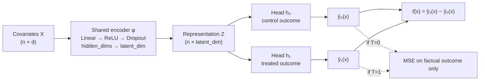

# Causal Representation Learning for Heterogeneous Treatment Effect Estimation

Do learned representations improve heterogeneous treatment-effect estimation
compared with conventional causal ML meta-learners — and under what conditions
do they stop helping?

This repository is an experimental study, not a demo. It compares four CATE
estimators across six controlled experiments on two benchmarks, reports every
result with dispersion and paired significance tests, and states plainly where
the neural model wins, ties, and loses.

> **Every number in the Results section is generated by
> `scripts/build_results_section.py` directly from the CSVs in `results/raw/`.**
> No metric in this README was typed by hand. Experiments that have not been run
> are rendered as explicit `PENDING` lines rather than estimated or omitted.

---

## 1. Research question

> Can learned representations improve heterogeneous treatment-effect estimation
> compared with conventional causal ML learners under varying levels of
> confounding and treatment imbalance?

The question is comparative and conditional. A single average score cannot
answer it, so the design varies confounding, imbalance and sample size as
explicit experimental factors and measures how each estimator responds.

## 2. Motivation

Meta-learners (S/T/X) reduce causal estimation to a set of standard regression
problems. That is a strength — any regressor can be plugged in — but it means
each arm's outcome model is fitted in isolation. When one treatment arm is
small, its model is estimated from few units and nothing in the procedure lets
the larger arm inform it.

A shared representation is the obvious structural answer: if both potential
outcome surfaces depend on the same underlying features of `X`, learning those
features jointly should let the data-rich arm regularise the data-poor one.
That is the mechanism this project tests. It is a hypothesis about *when*
representation sharing pays off, not an assumption that it always does.

## 3. Causal formulation

Using the Neyman–Rubin potential outcomes framework, each unit `i` has
covariates `X_i`, a binary treatment `T_i ∈ {0,1}` and two potential outcomes
`Y_i(0)`, `Y_i(1)`. Only the one matching the assigned treatment is observed:

```
Y_i = T_i · Y_i(1) + (1 − T_i) · Y_i(0)
```

This is the fundamental problem of causal inference — the other outcome is
never observed for any unit, which is why treatment effects cannot be evaluated
on real data and why semi-synthetic benchmarks exist.

**Estimands.**

```
CATE:  τ(x) = E[ Y(1) − Y(0) | X = x ]
ATE:   τ    = E[ τ(X) ]
```

**Identifying assumptions.** These are what make `τ(x)` recoverable from
observational data, and each is a place the estimates can fail:

| Assumption | Statement | Role here |
|---|---|---|
| SUTVA | No interference between units; one version of treatment | Assumed throughout; both benchmarks generate units independently, so it holds by construction |
| Unconfoundedness | `(Y(0), Y(1)) ⟂ T \| X` | Holds in both benchmarks because every confounder is recorded. Experiment 2 varies *how strongly* the recorded confounders drive treatment |
| Positivity / overlap | `0 < P(T=1 \| X=x) < 1` for all `x` | Directly stressed by Experiments 2 and 3; measured per condition via propensity tails and the treated/control propensity KS statistic |

**Confounding and selection bias.** When covariates drive both treatment and
outcome, treated and control groups differ systematically, so the naive
difference in observed means estimates `E[Y|T=1] − E[Y|T=0]`, not `τ`. The
propensity score `e(x) = P(T=1 | X=x)` summarises that assignment mechanism;
as it approaches 0 or 1 for some units, those units have effectively no
counterparts in the other arm and their effects must be extrapolated rather
than estimated.

**Distribution shift.** Because treated and control covariate distributions
differ under confounding, a model fitted on one arm is applied to units drawn
from a different distribution when predicting the counterfactual. This is the
covariate-shift problem that motivates representation learning here.

## 4. Datasets

Two benchmarks are used deliberately, and the reason is methodological rather
than cosmetic.

### IHDP (semi-synthetic) — external validity

The Infant Health and Development Program benchmark in its standard NPCI form:
747 units, 25 covariates, 100 independent outcome realizations, with noiseless
response surfaces `mu0` and `mu1` so PEHE is exactly computable. Covariates and
treatment come from a real randomized experiment; Hill (2011) then removed all
treated children of non-white mothers, which breaks randomization and
manufactures confounding.

Verified directly against the raw files rather than assumed: the pooled
train+test covariate matrix is *identical* across all 100 realizations and the
pooled treated fraction is exactly **0.1861** throughout. What varies per
realization is (a) which 672 of 747 units land in train vs test, and (b) the
simulated response surfaces. Realizations are therefore genuine replicates.

**IHDP cannot answer Experiments 2 and 3.** Its confounding level and treatment
mechanism are fixed properties of the published files. Treating them as
experimental factors would require inventing a knob that does not exist.

### Synthetic (fully controlled) — internal validity

A generator in which confounding strength and treated fraction are independent,
documented parameters:

```
X ~ N(0, I_d)                                        d = 20, k = 5 confounders
e(x)   = sigmoid( a0 + γ · (x[:, :k] @ w) )
T      ~ Bernoulli( e(x) )
mu0(x) = x @ β + 0.5·sin(π·x_0)
τ(x)   = 1 + 0.5·x_0 + 0.25·(x_1² − 1)
mu1(x) = mu0(x) + τ(x)
Y      = mu_T(x) + N(0, σ²)
```

`β` is non-zero on the first `k` covariates, so those covariates drive both
treatment and outcome — they are genuine confounders.

- **γ (`confounding_strength`)** scales how strongly confounders drive
  treatment. `γ = 0` is a randomized trial with perfect overlap; larger `γ`
  pushes propensities toward 0/1, creating selection bias and eroding positivity.
- **`a0`** is solved numerically by bisection to hit a target marginal
  `P(T=1)`, so imbalance can be varied while holding `γ` fixed.

Two design properties are enforced by unit tests, because without them the
experiments would be uninterpretable:

1. The intercept solver hits every target treated fraction at every `γ`, so the
   two factors are genuinely independent.
2. **The true ATE stays at 1.0 across all conditions.** Error changes therefore
   reflect estimation difficulty, not a moving estimand.

## 5. Methods

| Model | Strategy | Expected failure mode |
|---|---|---|
| **S-Learner** | One regressor on `[X, T]`; `τ̂ = f([x,1]) − f([x,0])` | A flexible learner can shrink the treatment feature toward zero, biasing effects to 0 |
| **T-Learner** | Separate regressor per arm; `τ̂ = f₁(x) − f₀(x)` | The smaller arm is fitted on few units; no sharing between arms |
| **X-Learner** | Per-arm models → cross-imputed effects → propensity-weighted blend | More robust when arms are unbalanced; more moving parts to misfit |
| **NeuralRep** | Shared encoder + treatment-specific heads (TARNet-style) | Needs enough data to learn a representation; can overfit small samples |

All meta-learners wrap the same gradient-boosting base regressor, so
differences between them reflect the *meta-learning strategy* rather than the
base model class.

## 6. Model architecture



Only the head matching a unit's **observed** treatment contributes to the loss;
the counterfactual head is exercised only at prediction time. No counterfactual
information enters training. The shared encoder is the sole channel through
which control units inform the treated head and vice versa — which is precisely
the mechanism Experiment 5 ablates.

Configurable: `hidden_dims`, `latent_dim`, `head_hidden_dims`, `dropout`,
`lr`, `batch_size`, `epochs`, `weight_decay`, `val_fraction`, `early_stopping`,
`patience`, `seed`.

## 7. Experimental design

| # | Experiment | Benchmark | Factor varied | Config |
|---|---|---|---|---|
| 1a | Baseline comparison | IHDP | — (30 seeds) | `configs/baseline.yaml` |
| 1b | Baseline comparison | Synthetic | — (30 seeds) | `configs/baseline_synthetic.yaml` |
| 2 | Confounding | Synthetic | γ ∈ {0, 1, 2, 3} | `configs/confounding.yaml` |
| 3 | Treatment imbalance | Synthetic | P(T=1) ∈ {0.5, 0.25, 0.1} | `configs/treatment_imbalance.yaml` |
| 4a | Sample size | IHDP | 25/50/75/100% of train | `configs/sample_size.yaml` |
| 4b | Sample size | Synthetic | 25/50/75/100% of 8000 | `configs/sample_size_synthetic.yaml` |
| 5a | Component ablation | IHDP | 4 variants | `configs/ablation.yaml` |
| 5b | Component ablation | Synthetic | 4 variants | `configs/ablation_synthetic.yaml` |
| 6 | Hyper-parameter sensitivity | IHDP | latent dim, weight decay, lr, epochs | `configs/sensitivity.yaml` |

**Controls applied uniformly.** Covariates are standardized on training
statistics only; the outcome is standardized and predicted effects are rescaled
back to the original scale before evaluation, so all models are scored
identically. In sample-size experiments the **test set is held fixed** across
conditions, so differences reflect training size rather than a changing
evaluation set.

**Ablation variants** (Experiment 5) each change exactly one component:

| Variant | Change | Isolates |
|---|---|---|
| `full` | — | Reference |
| `no_representation` | Encoder → identity; heads read raw `X` | The learned representation |
| `no_treatment_heads` | One head on `[φ(x), t]` | Treatment-specific heads |
| `no_regularization` | `dropout = 0`, `weight_decay = 0` | Regularization |

The `epochs` sweep in Experiment 6 disables early stopping automatically,
otherwise the epoch budget would not actually vary.

## 8. Evaluation metrics

This is an estimation problem, so classification accuracy is deliberately
absent. Primary metrics:

| Metric | Definition | Reads as |
|---|---|---|
| **PEHE** | `sqrt( mean_i (τ̂(x_i) − τ(x_i))² )` | Individual-level accuracy; the headline metric |
| **Absolute ATE error** | `\| mean(τ̂) − mean(τ) \|` | Population-level accuracy |
| **CATE MAE / bias** | `mean\|τ̂ − τ\|` / `mean(τ̂ − τ)` | Magnitude vs systematic direction of error |
| **Policy value** | `E[ π(x)·mu1 + (1−π(x))·mu0 ]`, `π = 1{τ̂ > 0}` | Value of acting on the estimates |
| **Policy regret** | Gap to the oracle `E[max(mu0, mu1)]` | Decision-quality loss; 0 is optimal |
| **Subgroup PEHE** | PEHE within quartiles of true `τ` | Whether errors concentrate in high-effect units |

Policy value is computed **exactly** from the known response surfaces, not
estimated by inverse propensity weighting.

**Design diagnostics** are recorded per condition, independent of any outcome
model: treated fraction, propensity range, mass in the tails `e<0.1` / `e>0.9`,
the treated-vs-control propensity KS statistic, and standardized mean
differences. These characterise how hard each condition is.

## 9. Statistical protocol

- Replicates are independent seeds — for IHDP, distinct outcome realizations.
- **All of Experiments 1–5 use 30 seeds**, fixed uniformly in advance rather
  than tuned per experiment. Experiment 6 uses 10 seeds because it sweeps 20
  hyper-parameter settings. An earlier 10-seed pass left several comparisons
  near the significance boundary; the seed count was raised for *every*
  experiment at once, not for the borderline ones, so no comparison was
  selected for extra power on the basis of its result.
- Reported as `mean ± SD (median)`. **The median matters here**: IHDP
  per-replicate errors are strongly right-skewed because a few realizations
  have very large outcome scales, so the mean is outlier-dominated.
- 95% confidence intervals are percentile bootstrap over replicates.
- Model comparisons use **paired** Wilcoxon signed-rank tests (all models see
  identical seeds and conditions), Holm-Bonferroni corrected within each
  condition.
- The word "significant" appears only where such a test was actually run.

---

## 10. Results

<!-- RESULTS_SECTION -->

---

<!-- FINDINGS_SECTION -->

---

## 15. Reproducibility

```bash
git clone https://github.com/Sriyansh-28/causal-representation-learning
cd causal-representation-learning
pip install -r requirements.txt
python scripts/download_data.py          # IHDP, SHA-256 verified
pytest -q                                # test suite

python experiments/run_experiment.py --config configs/baseline.yaml
python experiments/run_experiment.py --config configs/confounding.yaml
# ... any config in configs/
```

Reproduce every experiment and rebuild this README's results:

```bash
bash scripts/run_all.sh
python scripts/build_readme.py
```

**Determinism.** `set_seed` seeds Python, NumPy and PyTorch; data generation
uses explicit `np.random.Generator` instances rather than global state; the
DataLoader is given a seeded generator. Unit tests assert that identical seeds
reproduce identical predictions and that different seeds do not. The synthetic
DGP's structural coefficients use a fixed separate seed so replicates differ
only in the sampled data.

**Provenance.** Each run writes `results/raw/<name>_raw.csv` (one row per
model × seed × condition, with metrics and diagnostics) plus
`<name>_meta.json` recording the full config and a UTC timestamp.

## 16. Repository structure

```
causal-representation-learning/
├── configs/            # 9 YAML experiment configurations
├── data/               # README + git-ignored raw cache
├── src/
│   ├── data/           # base containers, IHDP loader, synthetic DGP, preprocessing
│   ├── models/         # RepresentationNet + trainer
│   ├── learners/       # S/T/X meta-learners + neural learner (shared interface)
│   ├── evaluation/     # metrics, diagnostics, statistics
│   ├── experiments/    # registry, runner, aggregation, plots
│   └── utils/          # seeding, config, paths
├── experiments/run_experiment.py   # single CLI entry point
├── notebooks/          # exploration only; no reported result depends on them
├── results/            # raw CSVs, tables, figures
├── scripts/            # data download, batch runner, README builder
└── tests/              # unit tests
```

## 17. Extending to another benchmark (e.g. ACIC)

Implement a loader returning a `DataSplit` of `CausalDataset` objects
(`src/data/base.py`) and add one branch to `build_dataset` in
`src/experiments/registry.py`. No model, metric, or experiment code changes —
all six experiments become available to the new benchmark immediately. The same
applies to estimators: implement `fit` / `predict_cate` from `BaseCATELearner`
and register it.

## 18. References

1. Hill, J. L. (2011). Bayesian Nonparametric Modeling for Causal Inference.
   *Journal of Computational and Graphical Statistics*, 20(1), 217–240.
   — origin of the IHDP benchmark.
2. Johansson, F. D., Shalit, U., & Sontag, D. (2016). Learning Representations
   for Counterfactual Inference. *ICML*. — representation learning for CATE;
   source of the NPCI IHDP files used here.
3. Shalit, U., Johansson, F. D., & Sontag, D. (2017). Estimating Individual
   Treatment Effect: Generalization Bounds and Algorithms. *ICML*. — TARNet /
   CFR, the architecture family this project's neural model belongs to.
4. Künzel, S. R., Sekhon, J. S., Bickel, P. J., & Yu, B. (2019). Metalearners
   for Estimating Heterogeneous Treatment Effects using Machine Learning.
   *PNAS*, 116(10), 4156–4165. — S/T/X-learner definitions.
5. Rubin, D. B. (1974). Estimating Causal Effects of Treatments in Randomized
   and Nonrandomized Studies. *Journal of Educational Psychology*, 66(5).
   — potential outcomes framework.
6. Rosenbaum, P. R., & Rubin, D. B. (1983). The Central Role of the Propensity
   Score in Observational Studies for Causal Effects. *Biometrika*, 70(1),
   41–55. — propensity scores, overlap.
7. Imbens, G. W., & Rubin, D. B. (2015). *Causal Inference for Statistics,
   Social, and Biomedical Sciences*. Cambridge University Press.
8. Louizos, C., Shalit, U., Mooij, J., Sontag, D., Zemel, R., & Welling, M.
   (2017). Causal Effect Inference with Deep Latent-Variable Models. *NeurIPS*.
9. Nie, X., & Wager, S. (2021). Quasi-Oracle Estimation of Heterogeneous
   Treatment Effects. *Biometrika*, 108(2), 299–319.

## License

MIT — see [LICENSE](LICENSE).
